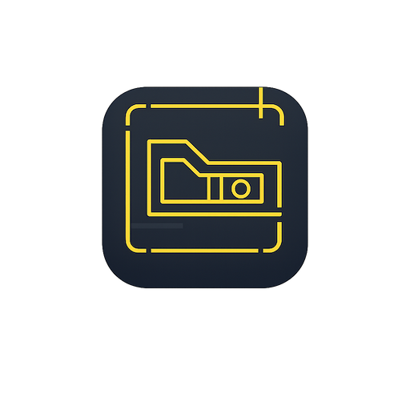

<p align="center">
  
</p>

<h1 align="center">izCAD</h1>

<p align="center">
  Offline DXF & DWG viewer for Android<br>
  Android için çevrimdışı DXF ve DWG görüntüleyici
</p>

<p align="center">
  <a href="#türkçe">Türkçe</a> ·
  <a href="#english">English</a>
</p>

---

## Türkçe

izCAD, Android cihazlarda DXF ve DWG çizimlerini tamamen çevrimdışı açmak ve
görüntülemek için geliştirilmiş açık kaynak bir CAD görüntüleyicidir. Uygulama
çizimleri düzenlemez, değiştirmez veya bir sunucuya göndermez.

### Özellikler

- DXF ve DWG dosyalarını cihazdan seçme
- DWG dosyalarını cihaz üzerinde LibreDWG WebAssembly ile DXF'e dönüştürme
- Çevrimdışı çalışma; Android `INTERNET` izni yok
- Pan ve iki parmakla yakınlaştırma
- Yakınlaştır, uzaklaştır, ekrana sığdır ve görünümü sıfırla
- Türkçe ve İngilizce arayüz
- Yerel TEXT ve MTEXT font desteği
- Android 8.0 (API 26) ve üzeri
- Reklam, kullanıcı hesabı, analytics veya telemetri yok

### Kapsam

izCAD yalnızca görüntüleyicidir. CAD düzenleme, ölçülendirme, dosya kaydetme,
bulut senkronizasyonu ve kullanıcı hesabı özellikleri içermez.

DWG formatının çok sayıda sürümü ve üreticiye özel nesnesi bulunduğu için her
DWG dosyasının eksiksiz görüntüleneceği garanti edilmez. Desteklenmeyen veya
bozuk nesneler kontrollü bir hata oluşturabilir.

### Teknoloji

- React 19 ve TypeScript
- Vite
- Capacitor Android
- Capacitor Browser (yalnızca kullanıcı yasal/kaynak bağlantısına dokunduğunda)
- dxf-viewer ve Three.js
- `@mlightcad/libredwg-web@0.7.9`
- Web Worker ve WebAssembly

DWG dosyası ayrı bir Web Worker içinde DXF'e dönüştürülür. Elde edilen DXF
çizimi `dxf-viewer` ile WebGL üzerinde görüntülenir. Bütün işlem cihazda
gerçekleşir.

### Gereksinimler

- Node.js 22 veya üzeri
- npm
- Android Studio
- Android SDK 36
- JDK 21

### Kurulum

```powershell
git clone https://github.com/orgofjs/izCAD.git
cd izCAD
npm.cmd install
npm.cmd run android:prepare
```

Ardından `android/` klasörünü Android Studio ile açıp bir cihaz veya emülatörde
çalıştırın.

### Test ve kaynak doğrulama

```powershell
npm.cmd test
npm.cmd run build
npm.cmd run android:verify
```

### Debug APK

```powershell
npm.cmd run android:prepare
cd android
.\gradlew.bat assembleDebug
```

Oluşan dosya:

```text
android/app/build/outputs/apk/debug/app-debug.apk
```

### Gizlilik

izCAD kişisel veri toplamaz veya paylaşmaz. Seçilen çizimler yalnızca cihaz
üzerinde işlenir.

- [Gizlilik politikası](https://sites.google.com/view/izcad-gp-pp/ana-sayfa)
- [Play Data Safety hazırlığı](PLAY_DATA_SAFETY.md)

### Lisans

Copyright (C) 2026 İZ

izCAD, yalnızca GNU General Public License version 3
([GPL-3.0-only](LICENSE)) koşullarıyla yayımlanır. Üçüncü taraf bildirimleri
[THIRD_PARTY_LICENSES.md](THIRD_PARTY_LICENSES.md) dosyasındadır.

APK dağıtılırken aynı sürüme ait kaynak kodu ve LibreDWG'nin karşılık gelen
kaynak kodu da erişilebilir tutulmalıdır.

### Katkıda bulunma

Hata raporları ve pull request'ler kabul edilir. Gizli veya sahipli CAD
dosyalarını issue'lara yüklemeyin. Örnek çizim gerekiyorsa paylaşım iznine sahip
olduğunuz küçük bir dosya kullanın.

İletişim: [tepukmenajeri@gmail.com](mailto:tepukmenajeri@gmail.com)

---

## English

izCAD is an open-source Android viewer designed to open and display DXF and
DWG drawings entirely offline. It does not edit drawings, modify files, or
upload them to a server.

### Features

- Select DXF and DWG files from the device
- Convert DWG to DXF locally with LibreDWG WebAssembly
- Fully offline operation with no Android `INTERNET` permission
- Pan and pinch-to-zoom
- Zoom in, zoom out, fit to screen, and reset view
- Turkish and English interface
- Local font support for TEXT and MTEXT
- Android 8.0 (API 26) and newer
- No ads, accounts, analytics, or telemetry

### Scope

izCAD is a viewer only. It does not include CAD editing, measurement, file
saving, cloud synchronization, or user accounts.

DWG has many versions and vendor-specific objects, so complete rendering of
every DWG file cannot be guaranteed. Unsupported or damaged objects may
produce a controlled error.

### Technology

- React 19 and TypeScript
- Vite
- Capacitor Android
- Capacitor Browser (only when the user opens a legal/source link)
- dxf-viewer and Three.js
- `@mlightcad/libredwg-web@0.7.9`
- Web Workers and WebAssembly

The DWG file is converted to DXF in a dedicated Web Worker. The resulting DXF
is rendered with `dxf-viewer` and WebGL. The entire process stays on the
device.

### Requirements

- Node.js 22 or newer
- npm
- Android Studio
- Android SDK 36
- JDK 21

### Setup

```powershell
git clone https://github.com/orgofjs/izCAD.git
cd izCAD
npm.cmd install
npm.cmd run android:prepare
```

Open the `android/` directory in Android Studio and run it on a device or
emulator.

### Tests and source verification

```powershell
npm.cmd test
npm.cmd run build
npm.cmd run android:verify
```

### Debug APK

```powershell
npm.cmd run android:prepare
cd android
.\gradlew.bat assembleDebug
```

Output:

```text
android/app/build/outputs/apk/debug/app-debug.apk
```

### Privacy

izCAD does not collect or share personal data. Selected drawings are processed
only on the device.

- [Privacy policy](https://sites.google.com/view/izcad-gp-pp/ana-sayfa)
- [Play Data Safety preparation](PLAY_DATA_SAFETY.md)

### License

Copyright (C) 2026 İZ

izCAD is released exclusively under the GNU General Public License version 3
([GPL-3.0-only](LICENSE)). Third-party notices are available in
[THIRD_PARTY_LICENSES.md](THIRD_PARTY_LICENSES.md).

When an APK is distributed, the matching izCAD source and corresponding
LibreDWG source must remain available.

### Contributing

Bug reports and pull requests are welcome. Do not upload confidential or
proprietary CAD files to issues. If a sample drawing is needed, use a small
file that you have permission to redistribute.

Contact: [tepukmenajeri@gmail.com](mailto:tepukmenajeri@gmail.com)
